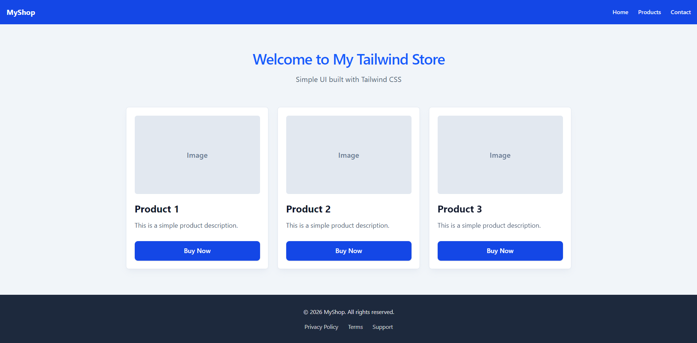

# MyShop - Tailwind CSS Practice Project

A simple e-commerce store UI built with **Tailwind CSS** and the Tailwind Browser CDN.

## Overview

This project demonstrates responsive web design and UI component building using Tailwind CSS. It features a modern, clean interface for an online shop with a navigation bar, hero section, product showcase, and footer.

## UI

<div align="center">
  
</div>

## Features

- **Responsive Design**: Mobile-first approach that adapts to all screen sizes
- **Navigation Bar**: Clean header with brand name and navigation links
- **Hero Section**: Welcoming introduction with title and tagline
- **Product Grid**: Three product cards with hover animations
- **Product Cards**:
  - Image placeholder
  - Product name and description
  - Call-to-action button
  - Hover effects with shadow and elevation
- **Footer**: Contact links and copyright information

## Technologies Used

- **HTML5**: Semantic markup structure
- **Tailwind CSS v4**: Utility-first CSS framework via CDN
- **Responsive Breakpoints**: `sm:`, `md:`, `lg:` for mobile, tablet, and desktop views

## Getting Started

### Prerequisites

- A modern web browser (Chrome, Firefox, Safari, Edge, etc.)
- No build tools or installation required!

### Running the Project

1. Open the `index.html` file directly in your web browser, or
2. Use a local server (recommended):

   ```bash
   # Using Python 3
   python -m http.server 8000

   # Using Node.js (http-server)
   npx http-server

   # Using PHP
   php -S localhost:8000
   ```

3. Navigate to `http://localhost:8000` in your browser

## Project Structure

```
WebDay05-UI-Practice-with-Tailwind-CDN/
├── index.html          # Main HTML file with embedded Tailwind styles
└── README.md          # This file
```

## Tailwind CSS Features Demonstrated

- **Layout**: Flexbox (`flex`, `flex-col`, `justify-between`, `items-center`)
- **Spacing**: Padding (`p-4`, `px-4`, `py-8`), margins (`mt-4`, `mb-14`)
- **Typography**: Text sizes (`text-lg`, `text-4xl`), weights (`font-bold`, `font-semibold`), colors
- **Colors**: Blue palette (`bg-blue-700`, `text-blue-600`), slate palette for backgrounds
- **Responsive**: Grid (`md:grid-cols-3`), responsive padding (`sm:px-6`, `lg:px-8`)
- **Effects**: Shadows (`shadow-lg`), transitions (`transition`, `duration-300`), hover states
- **Components**: Cards, buttons, navigation

## Customization

You can easily customize the project by:

1. **Changing Colors**: Update Tailwind color classes (e.g., `blue-700` → `purple-700`)
2. **Adjusting Layout**: Modify grid columns (`md:grid-cols-3`) or breakpoints
3. **Adding Content**: Update product names, descriptions, and links
4. **Styling Elements**: Add or modify Tailwind utility classes

### Example: Changing Theme Color

Replace `blue-700` with your preferred Tailwind color throughout the file.

## Resources

- [Tailwind CSS Documentation](https://tailwindcss.com/docs)
- [Tailwind CSS Browser Build](https://tailwindcss.com/blog/tailwindcss-v4-beta#the-browser-build)
- [Tailwind CSS Colors](https://tailwindcss.com/docs/customizing-colors)

## License

This is a practice project. Feel free to use it as a learning resource or template.

---

**Created**: May 2026  
**Purpose**: UI Practice with Tailwind CSS
